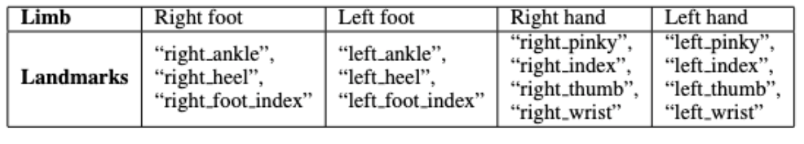
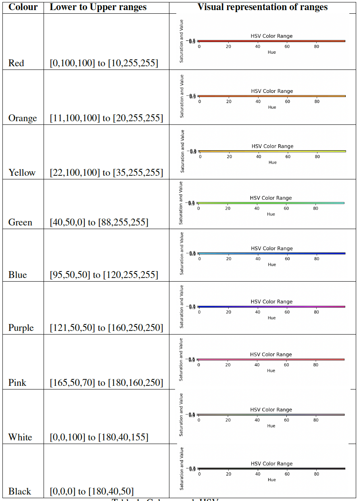
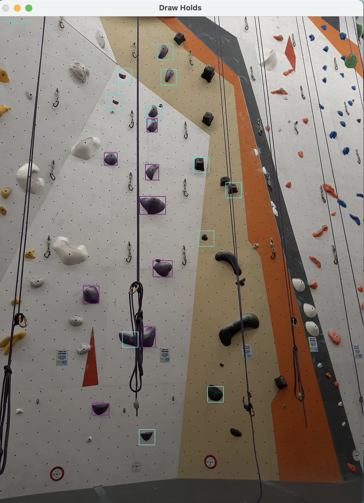
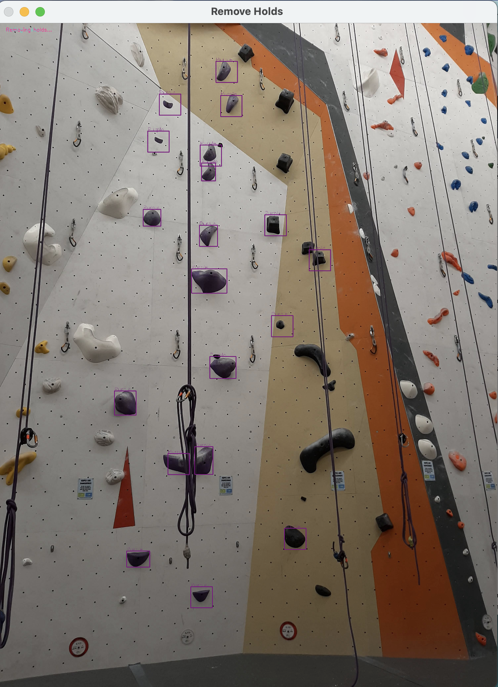
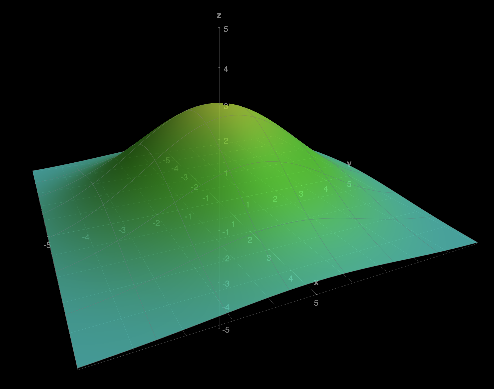

# Indoor Rock Climbing Assistance Tool (IRCAT)

*By Asad Khan, Laura Madrid, Lucas Noritomi-Hartwig*

## Introduction

Indoor rock climbing originated in the 1970's. Since then, it has gained massive popularity by providing a physical and mental stimulus for individuals of diverse age groups and abilities. The world of indoor rock climbing is constantly developing and is particularly of interest to computer scientists due to its various aspects, inviting exploration into areas such as path generation, pose estimation, hold detection, and human-object interaction for research and study. In regards to finding rock holds, and inferring a climbing path, climbers heavily rely upon their sight. However, those who are visually impaired must rely on their other senses to perform the same tasks. Our project consisted of building the Indoor Rock Climbing Assistance Tool (IRCAT) to effectively assist visually impaired indoor rock climbers by making next step suggestions during their top rope or auto-belay ascent.
## How to Run
### General Experience
Go to your nearest climbing gym and try it out by running `main.py`.

### Virtual Experience
If you want to test the hold calibration, colour detection and user interaction aspect of the project, you are welcome to use one of the images from the `test_images` folder. Before running `main.py`, make sure to comment the `ret, frame = cap.read()` and instead uncomment `frame = cv2.imread('test_images/<specified image>')`

## How it works

### Human Pose Estimation
We decided to use the MediaPipe Framework to get the climber's pose. MediaPipe's pose object is capable of detecting 32 landmarks in the body, however our tool only uses the landmarks pertaining to the hands and feet.

For the following limbs we took the following landmarks:

We aimed for a singular representative point for each limb, selecting the centroid of the polygon formed by the chosen landmarks to fulfill this purpose.

### Rock Hold Object Detection
For YOLOv8 model training, we utilized the Roboflow dataset from the [Climbing Hold Detection Computer Vision Project](https://universe.roboflow.com/shane-robertson-9azgn/climbingholddetection), comprising 404 annotated images depicting various hold types (Crimp, Jug, Pinch, Pocket, Sloper). While our focus didn't involve the hold types, the model demonstrated proficiency in detecting diverse hold variations, though it encountered challenges with very small foot holds.

To provide real-time guidance, we utilized the iPhone 13 for camera capture. During live feed processing, computations were performed on each frame, based on the previously mentioned aspects of the project. Initially, our simultaneous implementation of hold detection and pose estimation caused route instability. To resolve this, we introduced a calibration step, involving a second climber (often the belayer), to update and approve the route before the climb commenced. Throughout the 30-second calibration period, the YOLOv8 model continuously generates predictions through the `calibrate_holds` function. We selectively utilize detections with a confidence threshold exceeding 75%, employing cv2's box annotator to mark the identified holds. Concurrently, we integrate route detection using nine distinct color masks. These masks are individually crafted by defining Hue, Saturation, and Value ranges for designated colors:

The detected holds are sorted based on these color masks or categorized as uncoloured if no mask corresponds to the detection in the `identify_routes` function. Subsequently, they are organized according to their respective colored routes, resulting in the maximum number of identified routes by the end of the calibration process.

Although the model exhibited limitations in accurately detecting footholds, prompting the need for user input to both update and select the climbing route. After the calibration stage, the user is prompted to select one of the possible routes on the wall based on the colors detected through the `add_detections` function.

Subsequently, the user can augment the climbing route by selecting holds that haven't been annotated. Upon clicking on a particular hold, a turquoise box representing the average size of holds along that route will appear.

Upon completion of this task, the user is directed by the `remove_detections` function to remove holds if needed by clicking within the vicinity of an annotated hold displayed on the screen. These holds are marked in magenta, signifying their intended deletion.

### Path Generation
The path generation component of IRCAT is a critical feature, facilitating a sequential identification of holds for the climber as they make progress up the rock climbing wall. Upon successfully grabbing a hold, the system employs a series of functions to identify the next target hold, prioritizing proximity to the current position of the limb.

When a climber grabs a hold, the IRCAT system initiates a sequence to determine the next target hold. This sequence involves the following steps:

1. **Detection of Hold Grabbing:** The function `check_grab_hold` calculates the distance between the climber's limb and the selected target hold over a period of 3 seconds. If the distance remains within a distance threshold of roughly 50 pixels (We use pixel measurements to gauge distances in our system), the hold is considered close enough to have been grabbed.

2. **Finding the Closest Next Hold:** Once a hold is grabbed, `find_closest_hold` is triggered. This function iterates through all detected holds, excluding those already grabbed, to find the nearest hold relative to the current position of the limb. It calculates the distance between the limb and each potential hold, selecting the one with the minimum distance as the next target.

3. **Updating Target Hold:** The identified closest hold then becomes the new `TARGET_HOLD`, updating the system's focus for the climber's next move.

The path generation process works in tandem with the pose estimation and audio feedback systems. Pose estimation tracks the climber's movements, providing real-time data to the path generation component. Subsequently, the audio feedback system communicates the next target hold to the climber, using changes in pitch to indicate the proximity to the target.

### Audio Feedback and Interaction
After the climber's pose and the rock holds have been detected, the system must convey how to perform the following move to the climber in a non-invasive, non-distracting, and intuitive manner, as well as take in live audio input from the climber to allow for adjustments to be made to the system during the climb.

To ensure that the feedback system is non-invasive to the climber, we implement it solely using audio, which requires minimum equipment (only earbuds), and whose volume can be adjusted to the comfort of the climber. The feedback system consists of only simple sine waves so that if others are speaking to the climber, the climber must only discern the words being spoken through the sine waves, instead of more complex signals.

To indicate to the climber where to reach for the next rock hold, we implement a sequence of sine waves whose period (or pitch) depends on the $L^2$ distance of the limb from the target hold given the $x$ and $y$ coordinate distances in the function `play_distance`. The pitch of the sound, otherwise the period of the sine wave, is computed using a variation of the 2-dimensional exponential function, and using the frequency of the note C-natural, $c = 261.63$ (the baseline), and tuned parameters:

$f(x, y) = c \cdot \left( b \cdot e^{-a \cdot \left(x^2 + y^2\right)} + 1 \right)$

where $a = 0.083666$, $b = 3$, and $c$ is the frequency of C-natural. We choose the note of C-natural as it is a relaxing tone that is less likely to agitate the ears when played often. Below we include a plot of the curve, where the center of the rock hold is imagined to be at the origin.

Similar to a metal detector, the pitch represents the proximity of the limb to the target hold. This simple design is intended to be as intuitive for users, requiring the least amount of training before usage.

This implementation uses the sounddevice python library, which offers an easy method for constructing a sine wave given a computed frequency. A separate thread waits for the coordinate distances to be sent every 5 frames, and then calculates the sine wave and plays it for a short interval.

During the climb, the climber may want to switch the limb that the system is using to target the next rock hold. This may be to gain a better position before performing the next larger step towards completing the climb. In any case, the system must easily take input with little effort from the climber, and be specific enough not to easily falsely assume an input. An initial thought was to detect a gesture on whichever limb is chosen. However, this would require that the chosen limb was not occupied with maintaining a hold. It would also run the risk of falsely classifying a regular movement as a gesture, which would cause confusion to the climber.

It was found that, similar to system feedback, input from the climber would best be taken in the form of audio using the microphone built into the earbuds, instructing the system on which limb to focus. This system used the audio\_feedback and speech\_recognition python libraries, and depended on Google's Web Speech API to convert audio to text for keyword searching.

## Relate Works & Possible Improvements
Please refer to the `report.pdf` file to learn about the related literature for the basis of our project.

## Useful Sources
If you are interested, feel free to refer to `literature_review.pdf` which summarizes various papers pertaining to this topic and their strategies.

